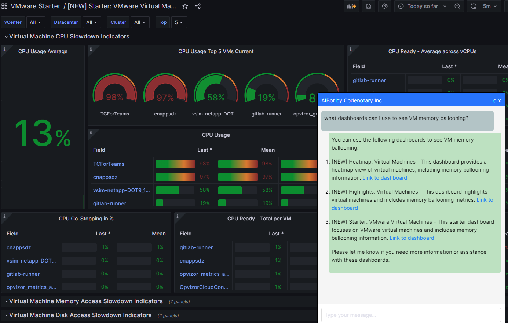

# Visualizations and dashboards.
You would typically get a dashboard on any enterprise grade monitoring solution however a simple dashboard usually does not tell the whole story.
Even more it can get frustrated if you need to write a complex query to get the data out. This is not the case with Opvizor.

Opvizor ships intuitive dashboards grouped in logical areas like starters, performance, capacity and planning.
With a set of curated dashboards per each section we ship a large collection of visualizations at all layers. In total **50+ dashboards** are available where each one of them contains more than 10 panels. 

## See how Opvizor compares to other products on specific areas

|                                                   | Opvizor                   | Dynatrace             | Datadog               | Instana               | Netdata                   |
|:--------------------------------------------------|:--------------------------|:----------------------|:----------------------|:----------------------|:--------------------------|
| Provisioned dashboards for all metrics            | yes                       | -                     | -                     | -                     | yes                       |
| Provisioned dashboards for a single host          | yes                       | partly                | partly                | partly                | yes                       |
| Provisioned dashboards for a flee of hosts        | yes                       | -                     | partly                | -                     | yes                       |
| Provisioned dashboards for distributed systems    | yes                       | -                     | partly                | -                     | yes                       |
| Metrics explorer                                  | yes                       | yes                   | yes                   | -                     | yes                       |
| Customizable dashboards                           | yes                       | yes                   | yes                   | -                     | yes                       |
| Live always up to date dashboards                 | yes                       | -                     | -                     | yes                   | yes                       |
| Context aware AI assistant per metrc              | yes                       | -                     | -                     | -                     | -                         |

Here is one of our dashboards where AI assistant helps to navigate through Opvizor dashboaards linking specific drill-down dashboards where you can jump right away.

----

Useful links

- [Our demo environmnet](https://demoml.codenotary.io/)
- [Official webpage](https://opvizor.com)
