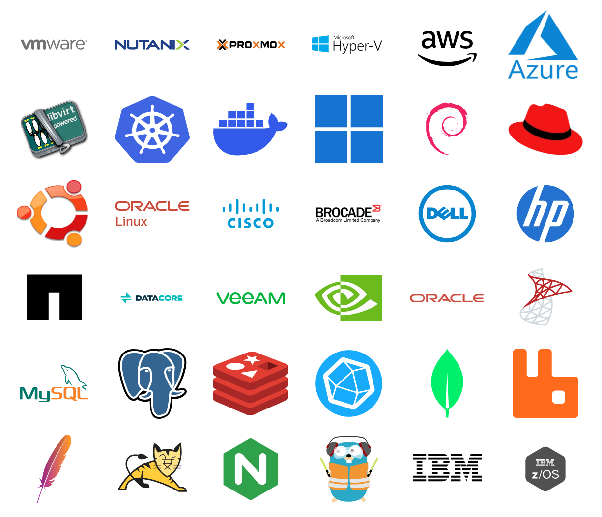

# Supported technologies and integrations.
Opvizor collects, visualizes and analyzes performance and health data for the following systems:

<!--       -->
<!--       -->

## Here is how Opvizor compares to other solutions

|                 | Opvizor                   | Dynatrace             | Datadog               | Instana               | Netdata                   |
|:----------------|:--------------------------|:----------------------|:----------------------|:----------------------|:--------------------------|
| VMware          | yes                       | yes                   | party                 | -                     | yes                       |
| Nutanix         | yes                       | yes                   | yes                   | partly                | -                         |
| Proxmox         | yes                       | -                     | -                     | -                     | yes                       |
| HyperV          | yes                       | yes                   | yes                   | -                     | yes                       |
| AWS             | yes                       | yes                   | yes                   | partly                | yes                       |
| Azure           | yes                       | yes                   | yes                   | -                     | yes                       |
| Libvirt         | yes                       | -                     | -                     | yes                   | yes                       |
| Kubernetes      | yes                       | yes                   | yes                   | yes                   | yes                       |
| Docker          | yes                       | yes                   | yes                   | yes                   | yes                       |
| Windows         | yes                       | yes                   | yes                   | yes                   | yes                       |
| Debian          | yes                       | yes                   | -                     | -                     | yes                       |
| RHEL            | yes                       | yes                   | -                     | -                     | yes                       |
| Ubuntu          | yes                       | yes                   | -                     | -                     | yes                       |
| Oracle Linux    | yes                       | -                     | -                     | -                     | yes                       |
| Cisco           | yes                       | yes                   | yes                   | -                     | yes                       |
| Brocade         | yes                       | -                     | -                     | -                     | -                         |
| Dell            | yes                       | yes                   | yes                   | -                     | yes                       |
| HP              | yes                       | -                     | yes                   | -                     | yes                       |
| NetApp          | yes                       | yes                   | yes                   | -                     | yes                       |
| DataCore        | yes                       | -                     | -                     | -                     | -                         |
| VEEAM           | yes                       | -                     | yes                   | -                     | -                         |
| Nvidia          | yes                       | yes                   | yes                   | -                     | yes                       |
| Oracle          | yes                       | yes                   | yes                   | yes                   | yes                       |
| MSSQL           | yes                       | yes                   | yes                   | yes                   | yes                       |
| MySQL           | yes                       | yes                   | yes                   | yes                   | yes                       |
| Postgres        | yes                       | yes                   | yes                   | yes                   | yes                       |
| Redis           | yes                       | yes                   | yes                   | yes                   | yes                       |
| InfluxDB        | yes                       | -                     | yes                   | -                     | yes                       |
| MongoDB         | yes                       | yes                   | yes                   | yes                   | yes                       |
| RabbitMQ        | yes                       | yes                   | yes                   | yes                   | yes                       |
| Apache          | yes                       | yes                   | yes                   | yes                   | yes                       |
| Tomcat          | yes                       | tes                   | yes                   | yes                   | yes                       |
| Nginx           | yes                       | -                     | yes                   | -                     | yes                       |
| Traefik         | yes                       | -                     | yes                   | yes                   | yes                       |
| IBM             | yes                       | yes                   | yes                   | yes                   | yes                       |
| IBM z/OS        | yes                       | yes                   | -                     | yes                   | -                         |

----

Useful links

- [Our demo environmnet](https://demoml.codenotary.io/)
- [Official webpage](https://opvizor.com)
