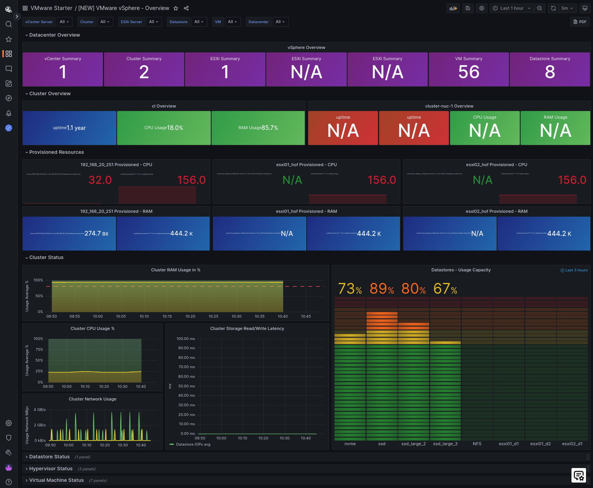

# Welcome to Opvizor's home!

Here we aim to give a high level comparison on features that people are typically looking for in virtualized infrastructure performance monitoring.

Before you dig into the other sections here's a short summary of key essentials why customers choose to go with Opvizor

## Performance monitoring, forecasting, reporting, event tracking 
### What our customers love about us

The built-in expertise detects performance issues pro-actively. Opvizor installs and optimizes your vSphere environment in minutes.

### Rapid Deployment:
Experience easy setup and use within just 5 minutes, ensuring a swift start.

### Unparalleled Performance Insights:
Gain access to unique insights that reveal the true performance of your systems.

### Resource Waste Identification:
Quickly pinpoint and address wasted resources in your infrastructure.

### Effective Resource Forecasting:
Simplify resource planning with straightforward and efficient forecasting tools.

### Bottleneck Detection:
Easily locate and resolve performance bottlenecks in ESXi hosts and VMs.

### Sensible Predefined Alerts:
Benefit from intelligently crafted alerts that are meaningful and actionable.

### Integrations:
Use built-in integrations for Linux, Windows, MS SQL, Oracle, NetApp, Cisco, Tanzu, AWS, Azure, Google Cloud and many more. 

### World-class Customer Support:
Rely on our top-tier customer support for any assistance you need.

----

Useful links

- [Our demo environmnet](https://demoml.codenotary.io/)
