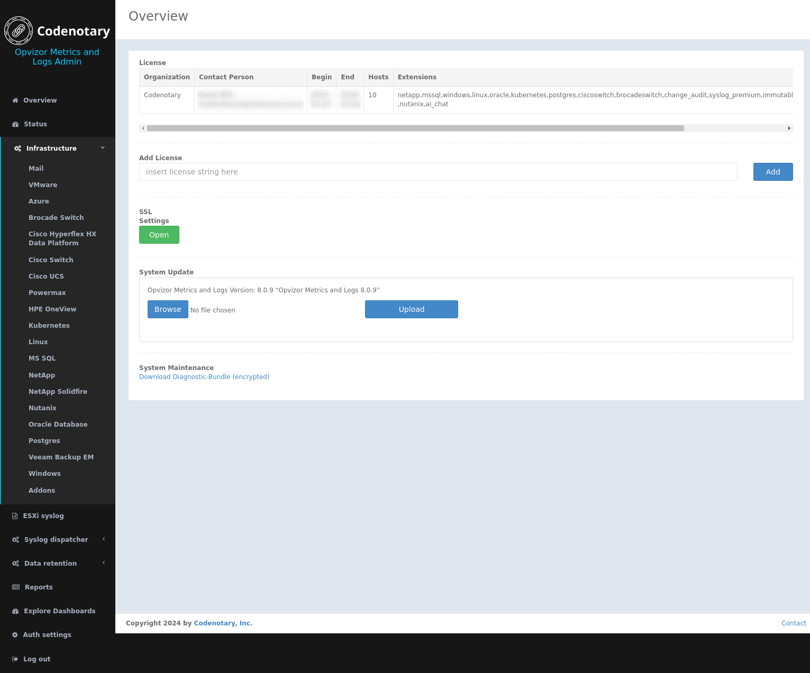

# Installation Complexity
Opvizor can be imported as a VM template within minutes.

Here are a few straight forward steps to get the Opvizor installed:
1. Register to get the virtual appliance download link: [https://opvizor.com/trial](https://opvizor.com/trial)
2. Extract the ZIP file, e.g. with Windows Explorer.
3. Import the appliance using your VMware vCenter. Use the function “Deploy OVF Template” or “Deploy OVF template”.  That import can take several minutes depending on your environment.
4. Start the appliance
5. Open the console and meet the CLI inteface

6. Head to the http://opvizor-ip/admin for a graphical admin panel 

----

Useful links

[Our demo environmnet]: https://demoml.codenotary.io/
